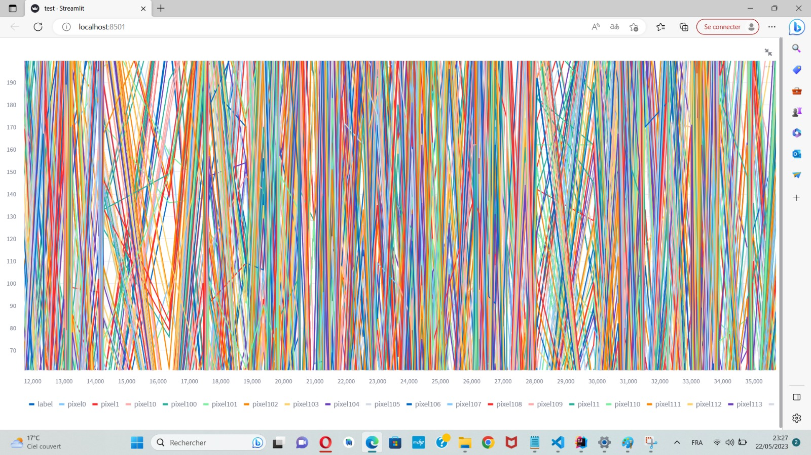

#Handwritten Digit Recognition using Neural Networks
This project focuses on the fascinating field of artificial intelligence (AI) and specifically on the recognition of handwritten digits. With the advancements in machine learning and deep learning, this project aims to leverage these technologies to create an accurate and efficient system for recognizing and digitizing handwritten text.

#Introduction
The development of artificial intelligence (AI) has opened up new possibilities and opportunities in various domains, including machine learning and deep learning. As a final module project, we have chosen to dive into this exciting discipline to apply the knowledge we have acquired throughout the semester.

Our project specifically focuses on a specific area of AI: handwritten digit recognition. This topic is both captivating and relevant as it represents a major challenge in the digitalization of handwritten documents and information. By tackling this problem, we aim to harness the advancements in machine learning and deep learning to create a system capable of accurately and efficiently recognizing and digitizing handwritten text.

We chose to work on such an interesting subject to deepen our understanding of neural networks and AI techniques. Neural networks, in particular, play a central role in handwritten digit recognition as they can learn to detect and interpret the unique features and patterns of handwritten characters.

This project provides us with an opportunity to apply the mathematical principles, theoretical concepts, and programming skills we have developed throughout the semester. We will cover the fundamental aspects of deep learning, including data collection and preparation, designing neural network architectures, training and evaluating models, and optimizing performance.

#Network Architecture
Our network will consist of a total of three layers: an input layer and two parameterized layers. Since the input layer does not have any parameters, this network is referred to as a two-layer neural network.

The input layer has 784 nodes, corresponding to each of the 784 pixels in the 28x28 input image. Each pixel has a value ranging from 0 to 255, with 0 representing black and 255 representing white. It is common to normalize these values to a range of 0 to 1, which can be achieved by simply dividing them by 255 before feeding them into the network.

To run the project:

1. Install the required dependencies.
2. Download the dataset files from the `data` directory.
3. Open a terminal or command prompt.
4. Navigate to the project directory.
5. Run the `main.py` script.

The project implements a neural network with a two-layer architecture. The architecture consists of an input layer, a hidden layer with ReLU activation, and an output layer with softmax activation. The weights and biases of the network are loaded from the `model` directory.

Here's an example of an important function in the code:

python
### `forward_prop(W1, b1, W2, b2, X)`

Performs forward propagation in the neural network.

**Arguments:**

- `W1`: Weight matrix for the first layer.
- `b1`: Bias vector for the first layer.
- `W2`: Weight matrix for the second layer.
- `b2`: Bias vector for the second layer.
- `X`: Input data.

**Returns:**

- `Z1`: Output of the first layer linear transformation.
- `A1`: Output of the first layer after applying the ReLU activation function.
- `Z2`: Output of the second layer linear transformation.
- `A2`: Output of the second layer after applying the softmax activation function.
You can customize and add more function documentation as needed for your project.

Data visualisation



## Project Structure

The project is structured as follows:
```
C:.
├── README.md
└── V1
├── main.py
├── training.py
├── data
│ ├── sample_submission.csv
│ ├── test.csv
│ └── train.csv
└── model
├── W1.npy
├── b1.npy
├── W2.npy
└── b2.npy
```


